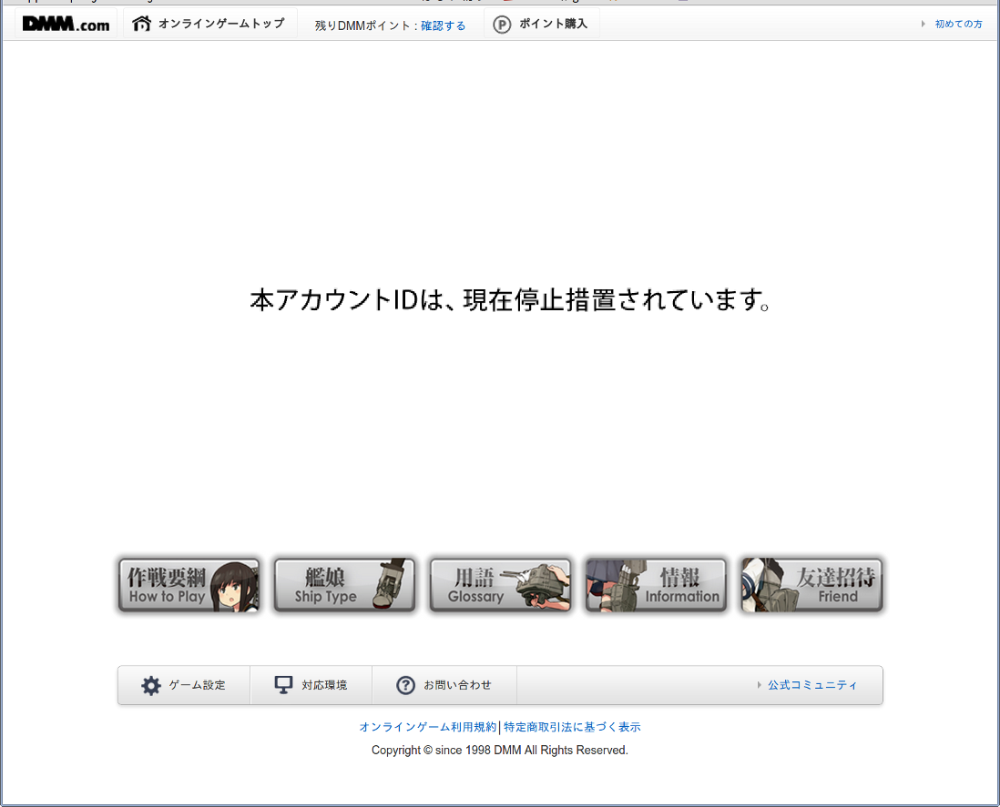

# ログイン

この章では艦これにログインするまでのやりとりを解説します。

## DMMにアクセスしてアプリを起動する

ゲームを始めるために、DMMにアクセスして艦これを起動します。

DMMのオンラインゲームは、他の多くのSNS上のソーシャルゲームと同様に、
DMMが用意する共通レイアウトの中に、ゲームプロバイダから指定された `gadget.xml` というファイルの内容に従って、`iframe` でゲーム本体を読み込む仕組みになっています。

DMMの内部では、アプリのキーやシークレットと共に、`gadget.xml` へのURLが登録されていると推測されます。
アプリ起動に必要な情報は全てDMMが持っているので、簡単に攻撃はできません。

### アプリ起動中に攻撃できる人

艦これの `gadget.xml` は、httpで配信されています。
それにアクセスして読むクライアントは *DMMサーバ* なので、httpでも外部からの攻撃には耐性があります。
ただし、DMMのサーバと艦これのサーバを繋ぐ **経路上にいる機器** を攻撃できた場合、
ニセの `gadget.xml` を配信することができるので *Man in the Middle 攻撃* (以下 **MitM攻撃** ) が成立します。
プロバイダの中の人とかじゃないとできないと思います。

## 艦これサーバにユーザ認証

`iframe` に艦これ本体が読み込まれると、艦これサーバへログイン認証が行われます。
まずjavascriptでDMMサーバにアクセスしているユーザの情報を取りに行きます。
DMMのユーザIDが取得できると、艦これサーバに接続し、所属する鎮守府を取得し、ログインAPIを叩きます。

ログインAPIが成功すると、
レスポンスには **api_token** と **api_starttime** という2つの情報が含まれていて、
この2つの情報をパラメータにしてflashを読み込み、ゲームが始まります。
ちなみに `IJN48` では、このflashを読み込む瞬間を *Chrome Extension* でフックし@<fn>{login-extension}、
ローカルに立てたサーバにトークンを送信して、認証情報を外の世界に送るという工夫をしています。
(この部分が一番独創的な部分だと思ってます)

//footnote[login-extension][[https://github.com/masarakki/IJN48/blob/master/crx/content_script.coffee]()]

ユーザがBANされている場合、特殊なレスポンスが返ってきて@{banned}のような画面になります。

### トークンの仕組み

後述するAPIは全て、この **api_token** と **api_starttime** をパラメータにしてリクエストします。
この2つのパラメータから艦これサーバで *ユーザを特定* しています。
逆に言うとこのパラメータさえ知っていれば、他のユーザに成りすますことが可能です。
このパラメータは艦これのユーザ認証を行うたびに新しい値が払い出されます。
イメージとしてOauthのアクセストークンに近いものがあります。

### ユーザ認証中に攻撃できる人

ほぼすべての人が攻撃できます。
この認証システムにはたくさんの問題があります。

#### http通信

サーバ間通信ではそれほど問題になりませんが、
今回はjavascriptにより *ユーザのブラウザと艦これサーバ* がログインの通信を行います。
*MitM攻撃* でログインの通信を覗かれた場合、
攻撃者は簡単にトークンを取得できるので **何でもやり放題** です。

ユーザとサーバ間の *MitM攻撃* は圧倒的に簡単に実現可能です。
外でも艦これするためにWindowsタブレットがバカ売れらしいですが、
パスワードがかかってない **野良WiFi** を見つけて、しめしめなんて思って繋いだりなんかしてないですよね?
その通信、全部覗かれますよ?

#### 生存期間

どうやら艦これのユーザ認証を行って新しいトークンを取得しない限り、**トークンは無限に生き続ける** ようです。
BANされていても半年間ゲームができたのは、このトークンを *自分のコンピュータのデータベースが覚えていた* からで、覚えていたトークンをパラメータにして *flashを直接リクエスト* すれば問題なくゲームができました。
BANが完全に有効になった理由は明らかではないですが、少なくとも半年の生存期間があるようでした。

#### BANの判定タイミング

BANの判定はログイン時のみ行われ、新しいトークンが取得できないという制限しかありません。
以前に取得した生きているトークンさえ知っていればBANが有効になりません。
逆に新しいトークンが取得できないことで、生きているトークンが特定しやすいという状態になっています。
全てのAPIアクセス時にサーバ内部でユーザのBAN判定をするべきです。
どうせトークンからユーザを復元する作業はしているはずなので負荷は増えません。

## まとめ: API改善ガイド

- 当たり前だけど全部 https にする
- トークンの生存期間を十分短い時間に設定する
- リクエスト毎にトークンを作りなおす/取得し直す
- リクエスト毎にサーバ側でBANの判定をする
- キーが2つあるのはそんなに意味がない api_starttimeは不要

APIレスポンスに次のトークンを含めるとかでいいと思います。
攻撃者が一度トークンを取得したら常に覗き続けられるのが一番まずい。
毎回トークンが変われば、攻撃者が1回APIレスポンスを見逃しただけで続きが見れなくなります。
他の効果として、 `IJN48` を動かしながら普通にゲームをプレイするのがかなり難しくなります。
